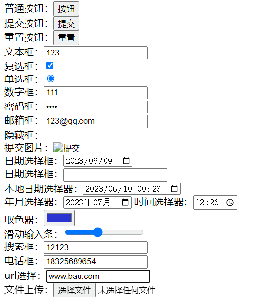

# 四、表单

在HTML中，一个完整的表单通常由表单控件（也称为表单元素）、提示信息和表单域3个部分构成。表单目的是为了收集用户信息。

## 1.input控件

```html
<input type="属性值" value="你好">
```

- input 输入的意思
- `<input />`标签为单标签
- type属性设置不同的属性值用来指定不同的控件类型

### 1.1 常用属性：

#### 1.1.1 type 

**type** 属性规定要显示的 `<input>` 元素的类型。

**注意：所有表单控件必须卸载form标签里**

| 属性值         | 描述                                                         |
| -------------- | ------------------------------------------------------------ |
| **button**     | 按钮                                                         |
| **text**       | 文本框                                                       |
| **textarea**   | 文本域                                                       |
| **checkbox**   | 复选框                                                       |
| **radio**      | 单选框                                                       |
| password       | 密码框，内容会以·······的形式显示                            |
| reset          | 重置按钮，会重置所在form标签内所有input的值                  |
| submit         | 提交按钮，提交所在form标签内表单的数据                       |
| file           | 上传文件控件                                                 |
| hidden         | 定义隐藏输入字段。                                           |
| number（H5）   | 只能输入数字的文本框                                         |
| tel（H5）      | 点击提交按钮，会自动验证是否为**电话号码**，否则提示         |
| email（H5）    | 点击提交按钮，会自动验证是否为**邮箱**，否则提示             |
| color（H5）    | 取色器                                                       |
| range（H5）    | 滑动输入条                                                   |
| url（H5）      | 点击提交按钮，会自动验证是否为**网址**，否则提示             |
| date           | 定义 date 控件（包括年、月、日，不包括时间）。               |
| datetime       | 定义 date 和 time 控件（包括年、月、日、时、分、秒、几分之一秒，基于 UTC 时区）。 |
| datetime-local | 定义 date 和 time 控件（包括年、月、日、时、分、秒、几分之一秒，不带时区）。 |
| month          | 定义 month 和 year 控件（不带时区）。                        |
| week           | 定义 week 和 year 控件（不带时区）。                         |

```html	
<form action="">
    普通按钮：<input type="button" value="按钮"><br>
    提交按钮：<input type="submit"><br>
    重置按钮：<input type="reset"><br>
    文本框：<input type="text"><br>
    复选框：<input type="checkbox"><br>
    单选框：<input type="radio"><br>
    数字框：<input type="number"><br>
    密码框：<input type="password"><br>
    邮箱框：<input type="email"><br>
    隐藏框：<input type="hidden"><br>

    提交图片：<input type="image"><br>

    日期选择框：<input type="date"><br>
    日期选择框：<input type="datetime"><br>
    本地日期选择器：<input type="datetime-local"><br>
    年月选择器：<input type="month">
    时间选择器：<input type="time"><br>

    取色器：<input type="color"><br>
    滑动输入条：<input type="range"><br>
    搜索框：<input type="search"><br>
    电话框：<input type="tel"><br>
    url选择：<input type="url"><br>
    文件上传：<input type="file"><br>
</form>
```



####  1.1.2 value

input控件的**默认值**

```html
用户名:<input type="text"  name="username" value="默认值"> 
```


####  1.2.3 name

- name表单的名字， 这样，后台可以通过这个name属性找到这个表单。 页面中的表单很多，name主要作用就是用于区别不同的表单。
- name属性后面的值，是我们自己定义的。
- **radio和checkbox  如果是一组，我们必须给他们命名相同的名字 name**  
- name属性，我们现在用的较少，但是，当我们学ajax 和后台的时候，是必须的。

单选框组

```html
<form action="">
    <input type="radio" name="sex" />男
    <input type="radio" name="sex" />女
</form>
```


复选框组

```html
<form action="">
    <input type="checkbox" name="sex" />唱
    <input type="checkbox" name="sex" />跳
    <input type="checkbox" name="sex" />rap
    <input type="checkbox" name="sex" />篮球
</form>
```


#### 1.2.4 placehoder

- 属性提供可描述输入字段预期值的提示信息

- placeholder 属性是 HTML5 中的新属性。
- 该提示会在输入字段为空时显示，并会在字段获得焦点时消失。
- placeholder 属性适用于以下的` <input>` 类型：text, search, url, telephone, email 以及 password。

```html
<input type="text" placeholder="请输入账号" />
```


#### 1.2.5 checked

- 表示**默认选中**状态。 较常见于单选按钮和复选按钮。

```html
性    别:
<input type="radio" name="sex" value="男" checked="checked" />男
<input type="radio" name="sex" value="女" />女 
```


## 2.label标签

- label 标签为 input 元素定义标注（标签）。

- label标签主要目的是为了提高用户体验。为用户提高最优秀的服务。

 **作用**：**用于绑定一个表单元素, 当点击label标签的时候, 被绑定的表单元素就会获得输入焦点。**

**用法**

- 第一种用法就是用label标签**直接包含input表单**， 适合单个表单选择，注意这种用法不能添加for属性

- 第二种用法 **for** 属性规定 `label` 与哪个表单元素绑定(**通过id**)。

```html
<label> 用户名： 
    <input type="radio" name="usename" value="请输入用户名">   
</label>


<label for="sex">男</label>
<input type="radio" name="sex"  id="sex">
```


## 3.textarea文本域

- 通过textarea控件可以轻松地创建多行文本输入框.

- cols="每行中的字符数" rows="显示的行数"  我们实际开发不用

```html
<textarea cols="30" rows="10">默认值</textarea>
```


**textarea属性**

| 属性            | 值        | 描述                                             |
| :-------------- | :-------- | :----------------------------------------------- |
| autofocus（H5） | autofocus | 规定当**页面加载时**，文本区域**自动获得焦点**。 |
| **cols**        | *number*  | 规定文本区域内可见的宽度。                       |
| **rows**        | *number*  | 规定文本区域内可见的行数。                       |
| **disabled**    | disabled  | 规定禁用文本区域。                               |
| form（H5）      | *form_id* | 定义文本区域所属的一个或多个表单。               |
| maxlength（H5） | *number*  | 规定文本区域允许的最大字符数。                   |
| name            | *text*    | 规定文本区域的名称。                             |
| **placeholder** | *text*    | 规定一个简短的提示，描述文本区域期望的输入值。   |
| **readonly**    | readonly  | 规定文本区域为只读。                             |
| required（H5）  | required  | 规定文本区域是必需的/必填的                      |
| wrap（H5）      | hard soft | 规定当提交表单时，文本区域中的文本应该怎样换行。 |

可以通过css属性`resize`设置文本域禁止调整大小

```css
textarea{
    resize: none;
}
```


## 4.select下拉列表

- 如果有多个选项让用户选择，为了节约空间，我们可以使用select控件定义下拉列表。
- 在`option` 标签中定义`selected =" selected"`时，当前项即为默认选中项。

```html
<select>
    <option>选项1</option>
    <option selected>选项2</option>
    <option>选项3</option>
</select>
```


## 5.form表单域

- 收集的用户信息通过form表单域传递给服务器
- 在HTML中，form标签被用于定义表单域，以实现用户信息的收集和传递，form中的所有内容都会被提交给服务器。

```html
<form action="url地址" method="提交方式" name="表单名称">
  各种表单控件
</form>
```

常用属性：

- 每个表单都应该有自己表单域。后面学 ajax 后台交互的时候，必须需要form表单域。

| 属性 | 属性值 | 作用 |
| - | - | - |
| action | url地址 | 用于指定接收并处理表单数据的服务器程序的url地址。 |
| method | get/post | 用于设置表单数据的提交方式，其取值为get或post。 |
| name | 名称 | 用于指定表单的名称，以区分同一个页面中的多个表单。 |


## 6.GET 和 POST 的区别

- GET在浏览器回退时是无害的，而POST会再次提交请求。

- GET请求会被浏览器主动cache，而POST不会，除非手动设置。

- GET请求只能进行url编码，而POST支持多种编码方式。

- GET请求参数会被完整保留在浏览器历史记录里，而POST中的参数不会被保留。

- GET请求大小一般是(1024字节)，http协议并没有限制，而与服务器，操作系统有关，POST理论上来说没有大小限制，http协议规范也没有进行大小限制，但实际上post所能传递的数据量根据取决于服务器的设置和内存大小。

- 对参数的数据类型，GET只接受ASCII字符，而POST没有限制。

- GET比POST更不安全，因为参数直接暴露在URL上，所以不能用来传递敏感信息。


## 7.acesskey 属性功能

表示访问Label 标签所绑定的元素的热键，当您按下**alt+热键**，所绑定的元素将获取焦点。

局限性：accessKey 属性所设置的快捷键不能与浏览器的快捷键冲突，否则将优先激活浏览器的快捷键。

```html
<!-- 按下 alt+s 此input会自动聚焦 -->
<input type="text" accesskey="s">
```

**注释：**以下元素支持 accesskey 属性：`<a>`, `<area>`, `<button>`, `<input>`, `<label>`, `<legend>` 以及 `<textarea>`。

