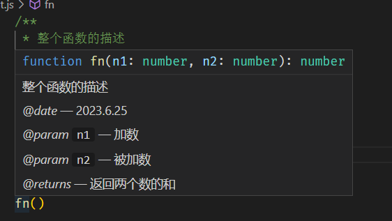

# jsdoc

不一定说任何函数方法都必须使用JSDoc，但是如果是自己封装的方法，有必要使用JSDoc

可以让其他成员**更容易的去了解你封装的方法的属性或返回值**，这样可以降低维护成本和提高开发效率。

函数(方法)注释也是多行注释的一种，但是包含了特殊的注释要求，参考[JSDoc中文文档](https://www.jsdoc.com.cn/)

**用法**

- vscode下载插件 `jsdoc`

- 鼠标左键按住，选中一个函数
- `ctrl+shift+p` 后输入 `gen jsdoc` 并选择 `gen jsdoc` 命令, 即可生成 jsdoc 风格的函数注释

在函数的上方输入`/**`再按`tab`键也可以生成

## 1.语法

```javascript
/**
 * 整个函数的描述
 * @date 日期
 * @param {参数一类型} n1 参数一描述
 * @param {参数二类型} n2 参数二描述
 * @returns {返回值类型} 返回值描述
 */
function fn(n1, n2) {
    return n1+n2
}
```

举例

```js
/**
 * 整个函数的描述
 * @date 2023.6.25
 * @param {number} n1 加数
 * @param {number} n2 被加数
 * @returns {number} 返回两个数的和
 */
function fn(n1, n2) {
    return n1+n2
}

fn()
```

当鼠标放上去之后，会显示此函数的用法、参数类型等



