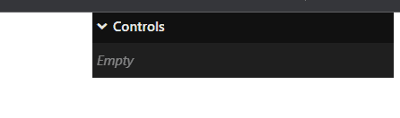
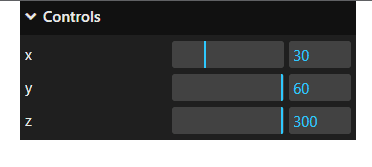
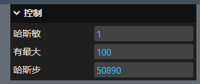
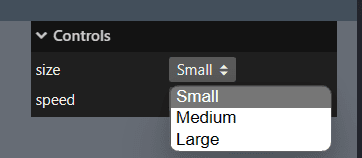
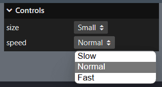
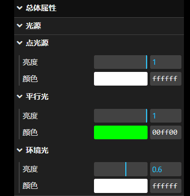
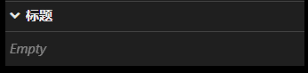
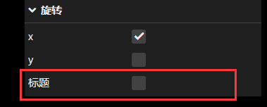

# Gui库

## 1.概念

`dat.gui.js`是一个前端js库，对HTML、CSS和JavaScript进行了封装，学习开发的时候，借助**dat.gui.js**可以**快速创建控制三维场景的UI交互界面**，使用之后会在右上角出现一个控制器，随着我们自己的配置，可以控制物体的各项属性

gui官方文档：[lil-gui 0.18.2 (georgealways.com)](https://lil-gui.georgealways.com/)

## 2.安装引入

- gihtub地址：https://github.com/dataarts/dat.gui
- npm地址：https://www.npmjs.com/package/dat.gui

### 2.1 threejs自带

我们下载的three库中也有对应的包

```js
import { GUI } from 'three/examples/jsm/libs/lil-gui.module.min.js';
```

### 2.2 使用cdn

模块化引入

```html
<script type="module">
	import GUI from 'https://cdn.jsdelivr.net/npm/lil-gui@0.18/+esm';
</script>
```

script标签引入

```html
<script src="https://cdn.jsdelivr.net/npm/lil-gui@0.18"></script>
<script>
	var GUI = lil.GUI;
</script>
```


### 2.3 npm下载

```bash
npm i lil-gui -D
```

引入

```js
import GUI from 'lil-gui';
```


## 3.基本用法

### 3.1 实例化对象

```js
const gui = new GUI();
```

实例化`gui`对象后，文档右上角会出现一个元素

`gui`元素默认添加到`body`元素下




### 3.2 修改gui界面的dom属性

通过`.domElement`属性可以获取gui界面的HTML元素，那就意味着你可以改变默认的style样式，比如位置、宽度等。

```js
//改变交互界面style属性
gui.domElement.style.right = '0px';
gui.domElement.style.width = '300px';
```


### 3.3 添加属性控件

执行`gui`对象的`add()`方法可以快速创建一个UI交互界面，比如一个拖动条，可以用来改变一个JavaScript对象属性的属性值。

#### 3.3.1 语法

```js
gui.add( object, property, [$1], [max], [step] )
```

- object：控制器需要修改的对象
- property：对象中需要被控制的属性
- $1： 数字控制器的最小值，或一组 下拉列表的可选值。
- max： 数字控制器的最大值。
- step：数字控制器的步长值。每次调整的间距

```js
gui.add( object, 'property' );
gui.add( object, 'number', 0, 100, 1 );
gui.add( object, 'options', [ 1, 2, 3 ] );
```


#### 3.3.2 基本用法

```js
const obj = {
    x: 30,
    y: 60,
    z: 300,
};
// gui界面上增加交互界面，改变obj对应属性
gui.add(obj, 'x', 0, 100);
gui.add(obj, 'y', 0, 50);
gui.add(obj, 'z', 0, 60);
```




### 3.4 创建物体模型属性控件

```js
// 创建一个立方体
const cubeGeometry = new THREE.BoxGeometry(20, 20, 20);
const cubeMaterial = new THREE.MeshLambertMaterial({
    color: 0x00ffff,
});
const cube = new THREE.Mesh(cubeGeometry, cubeMaterial);
scene.add(cube);


const gui = new GUI();
// 添加物体模型属性，并通过onchange事件重修渲染
gui.add(cube.position, "x", 0, 100).onChange((value) => {
    renderer.render(scene, camera);
});
```


### 3.5 数字和滑块控件

可以使用 和 将数字限制在一个范围内。您可以使用 将值舍入为给定数字的倍数。`min()` `max()` `step()`

```js
obj = { hasMin: 1, hasMax: 100, hasStep: 50890 }

gui.add( obj, 'hasMin' ).min( 0 );
gui.add( obj, 'hasMax' ).max( 100 );
gui.add( obj, 'hasStep' ).step( 10 );
```




### 3.6 下拉菜单

可以通过提供接受值的`数组`为任何数据类型创建下拉列表。

如果通过`对象`，其键将用作选项的标签。

```js
obj = { size: 'Small', speed: 1 }

gui.add( obj, 'size', [ 'Small', 'Medium', 'Large' ] )
gui.add( obj, 'speed', { Slow: 0.1, Normal: 1, Fast: 5 } )
```






### 3.7 添加颜色

通过`gui`对象的`addColor()`方法可以添加一个控制颜色的控件

il-gui 可识别多种格式的颜色：CSS 字符串、RGB 对象或整数十六进制值 仅举几例。可以使用 创建用于控制这些值的颜色选取器。

#### 3.7.1 基本用法

```js
const gui = new GUI()

obj = {
	color1: '#AA00FF',
	color2: '#a0f',
	color3: 'rgb(170, 0, 255)',
	color4: 0xaa00ff
}

gui.addColor( obj, 'color1' );
gui.addColor( obj, 'color2' );
gui.addColor( obj, 'color3' );
gui.addColor( obj, 'color4' );
```


#### 3.7.2 RGB 对象和数组

某些库使用 RGB 值的对象或数组来描述颜色。这些也可以控制 由。假定颜色通道介于 0 和 1 之间，但您也可以设置 自己的范围。颜色对象和数组永远不会被替换，只会修改它们的组件。`addColor()`

```js
obj = {
	colorObject: { r: 0.667, g: 0, b: 1 },
	colorArray: [ 0.667, 0, 1 ]
}

gui.addColor( obj, 'colorObject' );
gui.addColor( obj, 'colorArray' );
```


#### 3.7.3 RGB 通道范围

RGB 对象和数组的通道范围可以通过传递第三个控制器来覆盖 参数到 。如果颜色太亮，则可能需要将其设置为 255。`addColor()`

```js
obj = {
	colorObject: { r: 64, g: 135, b: 140 },
	colorArray: [ 170, 0, 255 ]
}

gui.addColor( obj, 'colorObject', 255 );
gui.addColor( obj, 'colorArray', 255 );
```


### 3.8 文件夹

可以通过gui对象的`addFolder()`方法把不同的控件分组，并且可以多级分组

分组后的文件夹对象同样用过`add()`方法添加控件

#### 3.8.1 语法

```js
const gui = new GUI()

// 二级文件夹
const firstFolder = gui.addFolder(name);
// 添加控件
folder.add( obj, 'key' );


// 三级文件夹
const secondFolder = gui.addFolder(name);
// 添加控件
secondFolder.add( obj, 'key' );
```

- name：文件夹名


#### 3.8.2 示例

```js
const gui = new GUI()
// 顶层控件
const light = gui.addFolder("光源");
light.close();

// 点光源组
const pointLightFolder = light.addFolder("点光源");
pointLightFolder
    .add(pointLight, "intensity", 0, 1)
    .name("亮度")
    .onChange((value) => {
    pointLight.intensity = value;
    renderer.render(scene, camera);
});

pointLightFolder
    .addColor(pointLight, "color")
    .name("颜色")
    .onChange((value) => {
    pointLight.color = value;
    renderer.render(scene, camera);
});
// 平行光组
const directionalLightFolder = light.addFolder("平行光");
directionalLightFolder
    .add(directionalLight, "intensity", 0, 1)
    .name("亮度")
    .onChange((value) => {
    pointLight.intensity = value;
    renderer.render(scene, camera);
});

directionalLightFolder
    .addColor(directionalLight, "color")
    .name("颜色")
    .onChange((value) => {
    pointLight.color = value;
    renderer.render(scene, camera);
});
// 环境光组
const ambientLightFolder = light.addFolder("环境光");
ambientLightFolder
    .add(ambient, "intensity", 0, 1)
    .name("亮度")
    .onChange((value) => {
    pointLight.intensity = value;
    renderer.render(scene, camera);
});
ambientLightFolder
    .addColor(ambient, "color")
    .name("颜色")
    .onChange((value) => {
    pointLight.color = value;
    renderer.render(scene, camera);
});
```




### 3.9 更改事件

当控件中的属性值更改，可以通过`onChange`事件做相应的操作，比如重新渲染画布

#### 3.9.1 语法

```js
const gui = new GUI();

gui.add(cube.position, "x", 0, 100).onChange((value) => {
    console.log(value)
});
```

- value：对象属性值更改过后的新值

### 3.10 初始化存储

使用 ，可以创建一个保存所有属性的当前值的对象 添加到图形用户界面。可以将该对象传递给 以还原保存的值。`gui.save()` `gui.load()`

下面创建一个可以保存预设的 GUI。按存储预设按钮，然后修改任何 控制器。按加载预设按钮可恢复您保存的值。

```js
let preset = {};

const obj = {
	value1: 'original',
	value2: 1996,
	savePreset() {
		// save current values to an object
		preset = gui.save();
		loadButton.enable();
	},
	loadPreset() {
		gui.load( preset );
	}
}

gui.add( obj, 'value1' );
gui.add( obj, 'value2' );

gui.add( obj, 'savePreset' );

const loadButton = gui.add( obj, 'loadPreset' ).disable();
```


### 3.11 链式调用

我们可以链式调用实例对象的方法

```js
gui.add(obj, "key", 0, 1)
    .name("控件名")
    .onChange((value) => {
        pointLight.intensity = value;
        renderer.render(scene, camera);
    });
```


## 4.GUI类

GUI即最大的控制器面板

```js
const gui=new GUI()
```

### 4.1 构造函数

```js
new GUI({ 
    autoPlace,
    container,
    width,
    title,
    closeFolders,
    injectStyles,
    touchStyles,
    parent 
})
```

| 属性         | 数据类型 | 默认值     | 描述                                                         |
| ------------ | -------- | ---------- | ------------------------------------------------------------ |
| autoPlace    | Boolean  | true       | 将 GUI 添加到页面并将其固定到页面的右上角                    |
| container    | Dom      | --         | 指定 GUI 添加到的 DOM 元素                                   |
| width        | Number   | 245        | GUI 的宽度（以像素为单位                                     |
| title        | String   | 'Controls' | 要在标题栏中显示的名称                                       |
| closeFolders | Boolean  | false      | 默认情况下，通过以关闭此 GUI 中的所有文件夹。                |
| injectStyles | Boolean  | true       | 如果这是第一个 GUI，则将默认样式表注入页面。 传递以使用您自己的样式表。 |
| touchStyles  | Boolean  | true       | 使触摸设备上的控制器更大。通过以禁用触摸样式。               |
| parent       | Gui      | --         | 将此 GUI 作为子级添加到另一个 GUI 中                         |


### 4.2 方法

#### add()

**作用**：添加一个控制器到GUI

**语法**：

```js
gui.add( object, property, [$1], [max], [step] )

gui.add( object, 'property' );
gui.add( object, 'number', 0, 100, 1 );
gui.add( object, 'options', [ 1, 2, 3 ] );
```

**参数**：

- object：控制器需要修改的对象
- property：对象中需要被控制的属性
- $1： 数字控制器的最小值，或一组 下拉列表的可选值。
- max： 数字控制器的最大值。
- step：数字控制器的步长值。每次调整的间距


**参数不同，生成的控件不同**

- 两个参数：
  - 属性值为Number：数字控件
  - 属性值为Boolean：复选框控件
- 三个参数，第三个参数为`Array`或`Object`：下拉菜单控件
- 四或五个参数：数字控件和滑块控件


#### addColor()

**作用**：添加一个颜色控制器到GUI

**语法**：

```js
gui.addColor( object, property, rgbScale=1 )
```

**参数**：

- object：控制器需要修改的对象
- property：对象中需要被控制的属性
- rgbScale：使用 RGB 颜色时颜色通道的最大值。如果颜色太亮，则需要将其设置为 255。
  默认值：`1`


#### addFolder()

**作用**：创建一个文件夹添加到 GUI。返回一个GUI，所以可以继续添加文件夹在此文件夹内

**语法**：

```js
gui.addFolder( title )
```

**参数**：

- title：文件夹名，String类型


#### load()

**作用**：调用使用保存的值

**语法**：

```js
gui.load( obj, recursive=true )
```

**参数**：

- obj：`Object`
- 递归：`Boolean`，传递 false 以排除从此 GUI 降序的文件夹。默认值：`true`


#### save()

**作用**：返回将控制器名称映射到值的对象。对象可以传递给 回想一下这些值。`gui.load()`

```js
{
	controllers: {
		prop1: 1,
		prop2: 'value',
		...
	},
	folders: {
		folderName1: { controllers, folders },
		folderName2: { controllers, folders }
		...
	}
}
```

**语法**：

```js
gui.save(recursive)
```

**参数**：

- recursive：传递 `false` 以排除从此 GUI 降序的文件夹。默认值为`true`


#### open()

**作用**：将一个GUI或文件夹设置为**打开状态**。默认情况下，GUI 和文件夹处于打开状态。

**语法**：

```js
gui.open(); // open
gui.open( false ); // close
gui.open( gui._closed ); // toggle
```

**参数**：

- 无参数：直接打开文件夹
- 一个参数：传递`true`打开文件夹，传递`false`关闭文件夹
- `gui._closed`：相当于一个开关，文件夹为打开状态时则关闭，反之亦然


#### close()

**作用**：将一个GUI或文件夹设置为**折叠状态**

**语法**：

```js
gui.close();
```


#### show()

**作用**：将一个GUI或文件夹**显示出来**，相当于去掉`css`属性`display:none;`

**语法**：

```js
gui.show();
gui.show( false ); // hide
gui.show( gui._hidden ); // toggle
```

**参数**：

- 无参数：直接显示文件夹
- 一个参数：传递`true`显示文件夹，传递`false`隐藏文件夹
- `gui._hidden`：相当于一个开关，文件夹为显示状态时则隐藏，反之亦然


#### hide()

**作用**：将一个GUI或文件夹**隐藏**，相当于添加`css`属性`display:none;`

**语法**：

```js
gui.hide()
```


#### title()

**作用**：给GUI添加标题

**语法**：

```js
gui.title(title)
```

**参数**：

- title：`String`，gui的标题




#### reset()

**作用**：将所有控制器重置为其初始值。

**语法**：

```js
gui.reset( recursive=true )
```

**参数**：

- recursive：传递 `false` 以排除从此 GUI 的子文件夹。默认值`true`


#### onChange()

**作用**：GUI中的属性值**一旦改变**，就会触发回调

**语法**：

```js
gui.onChange( value => {});

gui.add(obj,'key').onChange(value => {})
```

**回调函数参数**：

- value：对象属性值更改过后的新值


#### onFinishChange()

**作用**：GUI中的属性值**改变并失焦后**，触发回调

**语法**：

```js
gui.onFinishChange( value => {});

gui.add(obj,'key').onFinishChange(value => {})
```

**回调函数参数**：

- value：对象属性值更改过后的新值


#### onOpenClose()

**作用**：**gui文件夹折叠或打开**都会触发回调，低版本gui库可能使用不了

**语法**：

```js
gui.onOpenClose(gui=>{
    console.log(gui)	// Object
});
```

**回调函数参数**：

- gui：调用的gui对象


#### destroy()

**作用**：移除gui文件夹以及子文件夹的dom元素

**语法**：

```js
gui.destroy()
```

**参数**：


#### controllersRecursive()

**作用**：返回此 GUI 及其后代包含的**控制器**数组。

**语法**：

```js
const controllers= gui.controllersRecursive()
console.log(controllers)
```


#### foldersRecursive()

**作用**：返回此 GUI 及其后代包含的**文件夹**数组。

**语法**：

```js
const folders= gui.foldersRecursive()
console.log(folders)
```


### 4.3 属性

#### children

`Array`，获取一个 GUI 包含的**控制器和文件夹的列表**。


#### controllers

`Array`，获取一个GUI 包含的**控制器列表**。


#### domElement

`Dom`，获取和设置最外层的容器Dom元素。


#### folders

`Array`，获取一个 GUI 包含的**文件夹列表**。


#### parent

`GUI`，**获取此文件夹的父级GUI**，如果这是根 GUI。返回`undefined`


#### root

`GUI`，获取包含此文件夹的顶级 GUI


#### $children

`Dom`，获取包含子元素的 DOM 元素。


#### $title

`Dom`，获取包含标题的 DOM 元素。


#### _closed

`Boolean`，用于确定 GUI 是否已**折叠（关闭）**。使用 `gui.open()`或`gui.close()` 更改此设置。


#### _hidden

`Boolean`，用于确定 GUI 是否**隐藏**。使用`gui.show()`或`gui.hide()`更改此设置。


#### _onChange

`Function`，用于访问绑定到事件的函数。不要修改此值。

修改请改用该方法。`onChange.gui.onChange( callback )`


#### __onFinishChange

`Function`，用于访问绑定到事件的函数。不要修改此值 

修改请改用该方法。`onFinishChange.gui.onFinishChange( callback )`


#### _title

`String`，获取和修改GUI 的当前标题。用于修改此值。`gui.title( 'Title' )`


## 5.Controller类

通过`add()`或者`addColor()`添加进GUI内或者文件夹内的，称之为`Controller`

```js
const gui=new GUI()

cnost controller=gui.add(obj,'key')
```

### 5.1 方法

#### name()

**作用**：在 GUI 中设置控制器的**名称及其标题**。

**语法**：

```js
controller.name(name)
```

**参数**：

- name：`String`，标题名


```js
controller.name('标题')
```




#### onChange()

**作用**：`controller`中的属性值**一旦改变**，就会触发回调

**语法**：

```js
controller.onChange( value => {});

controller.add(obj,'key').onChange(value => {})
```

**回调函数参数**：

- value：对象属性值更改过后的新值


#### onFinishChange()

**作用**：`controller`中的属性值**改变并失焦后**，触发回调

**语法**：

```js
controller.onFinishChange( value => {});

controller.add(obj,'key').onFinishChange(value => {})
```

**回调函数参数**：

- value：对象属性值更改过后的新值


#### reset()

**作用**：将控制器设置回其初始值。

**语法**：

```js
controller.reset()
```


#### enable()

**作用**：启用控制器。

**语法**：

```js
controller.enable();  // 直接设置启动
controller.enable( false ); // 设置关闭
controller.enable( controller._disabled ); // 启动状态取反
```

**参数**：

- 无参数：直接设置启动控制器

- 一个参数：
  - 传入false，启动状态设置为关闭，
  - 传入`controller._disabled` ，启动状态取反


#### disable()

**作用**：禁用控制器。

**语法**：

```js
controller.disable();
controller.disable( false ); // enable
controller.disable( !controller._disabled ); // toggle
```

**参数**：

- 无参数：直接设置禁用控制器

- 一个参数：
  - 传入false，启动状态设置为开启，
  - 传入`controller._disabled` ，启动状态取反


#### show()

**作用**：显示隐藏后的控制器。相当于移除`css`属性`display:none`

**语法**：

```js
controller.show();
controller.show( false ); // hide
controller.show( controller._hidden ); // toggle
```

**参数**：

- 无参数：显示控制器

- 一个参数：
  - 传入false，隐藏控制器，
  - 传入`controller._disabled` ，显示状态取反


#### hide()

**作用**：隐藏控制器

**语法**：

```js
controller.hide();
```


#### options()

**作用**：销毁此控制器并**返回一个新**的**下拉菜单**选项控制器。

**语法**：

```js
controller.options(options)
```

**参数**：

- options：`Array || Object`，新控制器的下拉菜单配置项


注意：因为此方法将销毁对此控制器的旧引用。如果不按顺序调用，则更改控制器顺序，将选项控制器移动到 图形用户界面。

```js
// 正确

gui.add( object1, 'property' ).options( [ 'a', 'b', 'c' ] );
gui.add( object2, 'property' );

// 错误

const c = gui.add( object1, 'property' );
gui.add( object2, 'property' );

c.options( [ 'a', 'b', 'c' ] );
// controller is now at the end of the GUI even though it was added first

assert( c.parent.children.indexOf( c ) === -1 )
// c references a controller that no longer exists
```


#### min()

**作用**：设置最小值。仅适用于数字控制器。

**语法**：

```js
controller.min(number)
```

**参数**：

- number：最小值


#### max()

**作用**：设置最小大值。仅适用于数字控制器。

**语法**：

```js
controller.max(number)
```

**参数**：

- number：最大值


#### step()

**作用**：属性值每次变化的数值间隔。仅适用于数字控制器。

**语法**：

```js
controller.step(number)
```

**参数**：

- number：数值间隔


#### decimals()

**作用**：保留几位小数。仅适用于数字控制器

**语法**：

```js
controller.decimals(num)
```

**参数**：

- num：需要保留几位小数


#### listen()

**作用**：

**语法**：

**参数**：


#### getValue()

**作用**：返回控制器里属性的值

**语法**：

```js
controller.getValue(attr)
```

**参数**：

- attr：`String`，需要获取属性值的属性名

**用法**：

```js
const gui=new GUI()
const obj={ intensity:1 }
const controller=gui.add(obj,'key')

const intensity =controller.getValue("intensity")

console.log(intensity) // 1
```


#### setValue()

**作用**：给控制器的值

**语法**：

```js
controller.getValue(value)
```

**参数**：

- value：给控制器设置的值

**用法**：

```js
const gui=new GUI()
const obj={ intensity:1 }
const controller=gui.add(obj,'key')


controller.setValue(0.5)

console.log(controller.getValue("intensity")) // 0.5
```


#### updateDisplay()

**作用**：更新显示以使其与当前值保持同步。在 GUI 外部修改时有助于更新控制器的值 。

**语法**：

```js
controller.updateDisplay()
```


#### destroy()

**作用**：销毁此控制器并将其从父 GUI 中删除。Dom元素也会移除

**语法**：

```js
controller.updateDisplay()destroy()
```


### 5.2 属性

#### domElement

`Dom`，获取和设置此控制器最外层的容器Dom元素。


#### initialValue

创建控制器时的值


#### object

`Object`，控制器将修改的对象。


#### property

要控制的属性名


#### parent

`GUI`，包含此控制器的 GUI。


#### $disable

使用 disable（） 时接收禁用属性的 DOM 元素


#### $name

包含控制器名称的 DOM 元素。


#### $widget

包含控制器的“小部件”（因控制器类型而异）的 DOM 元素。


#### _disabled

用于确定控制器是否已禁用。 使用`controller.disable( true|false )`修改此值


#### _hidden

用于确定控制器是否隐藏，使用 `controller.show()`或`controller.hide()` 更改此设置。


#### _listening

用于确定控制器当前是否正在侦听。不可直接修改。

使用`controller.listen( true|false )`修改


#### _name

控制器的名称。使用`controller.name( 'Name' )`修改此值。


#### _onChange

用于访问绑定到事件的函数。不可直接修改此值。 

使用`controller.onChange( callback )`修改


#### _onFinishChange

用于访问绑定到事件的函数。不可直接修改此值。 

使用`controller.onFinishChange( callback )`修改

