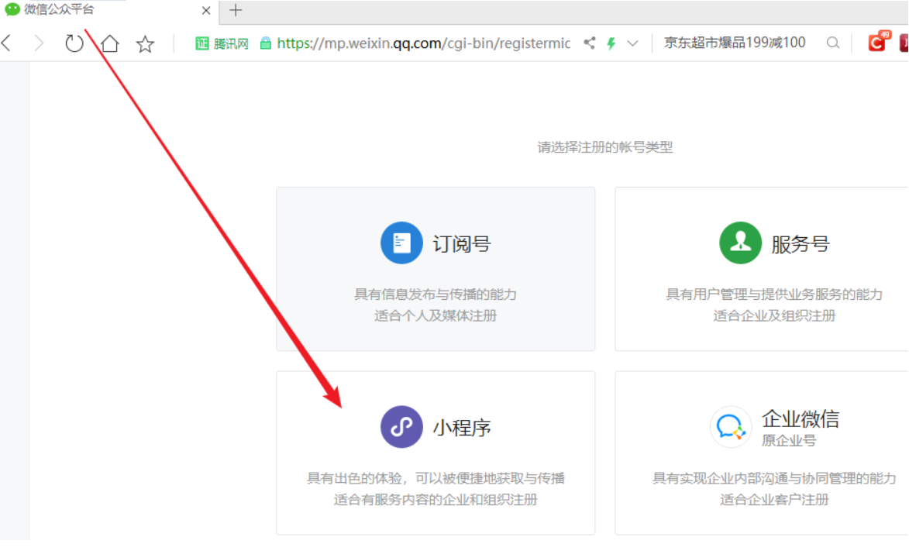
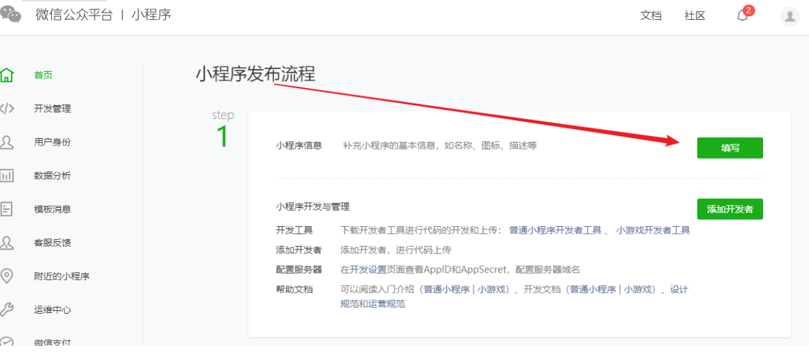
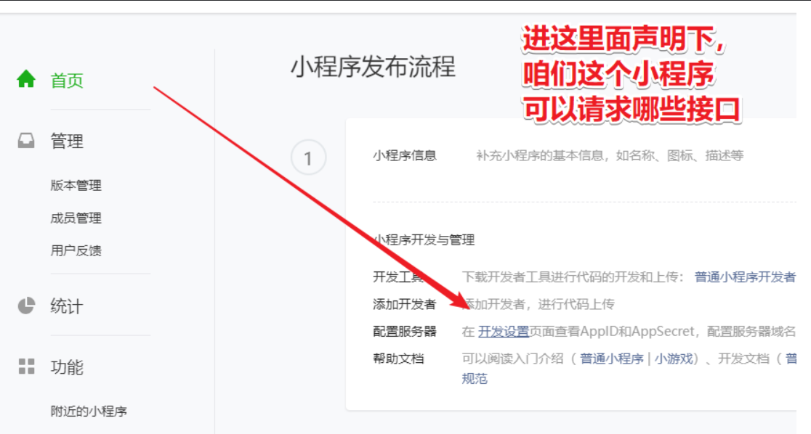
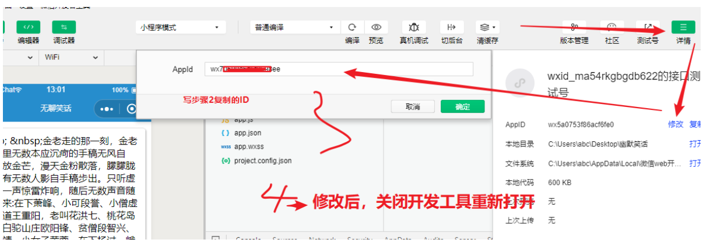

微信小程序

## 一、小程序简介

小程序与普通网页开发的区别

1. 运行环境不同 网页运行在浏览器中 小程序运行在微信环境中
2. API不同 由于运行环境不同，所以小程序中无法调用DOM和BOM的API 但是小程序中可以调用微信环境提供的各种API，例如： 地理定位 扫码 支付
3. 开发模式不同 网页的开发模式：浏览器+代码编辑器 小程序： 申请小程序开发账号 安装小程序开发者工具 创建和配置小程序项目

## 二、搭建开发环境

### 1、注册小程序开发账号

1.[微信公众平台](https://mp.weixin.qq.com/)点击注册


2.填写基本信息


### 2、获取AppID

开发管理→开发设置


### 3、下载微信开发工具

推荐下载和安装最新的稳定版的微信开发者工具，下载页面的链接：[下载](https://developers.weixin.qq.com/miniprogram/dev/devtools/stable.html)


### 4、登录

下载过程直接下一步，没有特别的设置

下载完之后第一次需要微信扫码

  


### 3、创建项目 

1. 选择小程序
2. 填写自己的AppID或者使用测试号
3. 不使用云服务
4. 根据需求选择开发模板


### 4、工具使用介绍

 


### 5、目录介绍

以前：.html（布局div/span） 、 .css（美化一样   px、rem）、.js （数据、异步请求
现在：.wxml（布局view/text）、.wxss（美化一样 rpx）、.js （数据、异步请求

提供了类似于Vue中的模板语法 数据绑定 列表渲染 条件渲染

留心：**微信小程序默认不支持超文本** 

结构


```
app.json  	全局配置：1 路由、2 小程序全局配置 全局顶部栏颜色/文字等、3 底部导航tabBar
app.wxss 	全局CSS文件，也就是这边声明背景红色，所有页面都会红色（相当于reset.scss   html/body  page
app.js     	全局JS文件，也就是这边console.log打印1，后期访问任意页面都会触发打印
utils目录    工具目录，封装全局异步请求、等工具方法（规则是按照commonjs规范
pages目录    同vue的views视图存放项目代码（pages下面1个目录对应1个页面）
	目录名
		.wxml   结构
		.wxss   样式
		.js     逻辑 
		.json   局部配置（重写全局配置  如导航栏文字、颜色等 
```

#### 5.1 app.json

`app.json`是当前小程序的全局配置，包括了小程序所有页面路径、窗口外观、界面表现、底部tab等


#### 5.2 project.config.json

`project.config.json`是项目配置文件，用来记录我们**对小程序开发工具所做的个性化配置**， 例如：

1. `setting`中保存了编译相关的配置
2. `projectname`中保存的是项目名称
3. `appid`保存的是小程序的账号ID


#### 5.3 sitemap.json

微信现已开发小程序内搜索，效果类似于PC网页的SEO。 `sitemap.josn`文件用来**配置小程序页面是否允许被微信索引**


#### 54 页面的json配置文件

**对本页面的窗口外观进行设置**，页面中的配置项会覆盖`app.json`的window中的相同配置项


## 三、初体验

- 需求：定义qf路由显示“hello，webopenfather”静态页面（红色字体）

- 留心：微信小程序中没有`div`和`span`等标签，只有`view`和`text`


1. 
   只能在`app.json`定义路由（**并且只能是双引号，最后一个不能加逗号否则都报错**）
2. **默认显示第一个路由**，
3. 通过微信小程序编辑器定义路由，**ctrl+s保存的时候会自动生成对应文件**，但是其他编辑器不会。


 

 


## 四、视图层 

### 1、路由&分包&编译模式

#### 1. 路由规则

微信小程序中路由必须在`app.json`中`pages`定义即可（最初1M -> 2M -> 8M -> 20M

#### 2. 分包

小程序单个包只能支持2M的内容，想要写更多的内容，就必须分包

- 实现分包：在`app.json`中`pages`同级添加`subpackages`键
- 首次写完得关闭开发工具重新打开否则报错

> app.json

- pages：主包配置，数组第一项就是第一个页面
- subpackages：分包配置
  - root：分包名
  - pages：分包页面路径
- window：全局配置

```json
{
  "pages":[
    "pages/qf/qf",		
    "pages/qf2/qf2",
    "pages/index/index",
    "pages/logs/logs"
  ],
  "subpackages": [
    {
      "root": "packageA",
      "pages": [
        "pages/test1/test1",
        "pages/test2/test2"
      ]
    },
    {
      "root": "packageB",
      "pages": [
        "pages/test1/test1",
        "pages/test2/test2"
      ]
    }
  ],
  "window":{
    "backgroundTextStyle":"light",
    "navigationBarBackgroundColor": "#fff",
    "navigationBarTitleText": "Weixin",
    "navigationBarTextStyle":"black"
  },
  "style": "v2",
  "sitemapLocation": "sitemap.json"
}
```


#### 3. 编译模式

分包后访问、或开发时**刷新访问指定页面**


 


### 2、数据绑定&判断&循环

留心：语法比较像vue所以一定要留心别写错了

语法：

**条件渲染**

**wx:if**

```html
<view wx:if="{{data中的键：boolean类型}}">你好</view>   
<view wx:elif="{{data中的键：boolean类型}}">我不好</view>  
<view wx:else>你确定？</view>  
```

**列表渲染**

**wx:for**

```html
<view wx:for="{{data中的键}}"></view>   
<!-- key默认是：index   循环项默认是：item -->

<!-- 修改index和item -->
<view wx:for="{{data中的键}}" wx:for-index="idx" wx:for-item="itemName"></view> 
```

**案例：**

> test.wxml

```html
<view>数据绑定：{{msg}}</view>

<!-- 当数据大于999 则牛逼 否则有瑕疵 -->
<view wx:if="{{ num > 999}}">判断：牛逼哥斯拉</view>
<view wx:else>判断：有瑕疵</view>

<!-- 循环 -->
<block wx:for="{{ orders }}">
  <view>{{index}}-{{item.id}}-{{item.title}}</view>
</block>


<!-- 循环自定义item -->
<view 
  wx:for="{{ orders }}" 
  wx:for-index="idx" 
  wx:for-item="itemName"
  wx:key="idx"
>
  <view>{{idx}} {{itemName.id}} {{itemName.title}}</view>
</view>
```

> test.js

```js
export default {
    data(){
        return{
            msg:'你好',
            num:995,
            order:[
                {
                    id:1,
                    title:'牛德画'
                },
                {
                    id:2,
                    title:'雷明'
                }
            ]
        }
    }
}
```

**block标签**

相当于vue里的`template`标签，不会生成真实的dom结构

> ```html
><view wx:if="{{false}}">------ 1</view>
> 
> <block wx:for="{{orders}}" wx:key="idx" wx:for-index="idx" wx:for-item="itemName">
>     {{itemName.title}}  {{idx}}
> </block>
> ```

**hidden属性**

相当于vue的`v-show`

```html
<view hidden="{{true}}">------ 2</view>
```


### 3、事件&事件传参

#### 语法

- 定义事件在标签中通过：`bind事件类型="函数名"`
- 事件传参通过在标签中：`data-参数名="值"`
- 获取参数用：`e.currentTarget.dataset.键`

**注意**：函数名不能加小括号，传递参数也不行

```html
<view id="tapTest" data-hi="Weixin" bindtap="tapName"> Click me! </view>


获取模型数据：this.data.键
设置模型数据：this.setData({键:值,....}, 可选callback)
```

#### 事件类型

| 类型               | 触发条件                                                     |
| :----------------- | :----------------------------------------------------------- |
| **touchstart**     | **手指触摸动作开始**                                         |
| **touchmove**      | **手指触摸后移动**                                           |
| touchcancel        | 手指触摸动作被打断，如来电提醒，弹窗                         |
| touchend           | 手指触摸动作结束                                             |
| **tap**            | **手指触摸后马上离开**                                       |
| longpress          | 手指触摸后，超过350ms再离开，如果指定了事件回调函数并触发了这个事件，tap事件将不被触发 |
| longtap            | 手指触摸后，超过350ms再离开（推荐使用 longpress 事件代替）   |
| transitionend      | 会在 WXSS transition 或 wx.createAnimation 动画结束后触发    |
| animationstart     | 会在一个 WXSS animation 动画开始时触发                       |
| animationiteration | 会在一个 WXSS animation 一次迭代结束时触发                   |
| animationend       | 会在一个 WXSS animation 动画完成时触发                       |
| touchforcechange   | 在支持 3D Touch 的 iPhone 设备，重按时会触发                 |


### 4、内置组件

#### swiper

轮播图


#### rich-text

可以解析富文本


#### web-view

在微信小程序中嵌入一个移动网站，通过src属性写网址

承载网页的容器。会自动铺满整个小程序页面，个人类型的小程序暂不支持使用。

```html
<web-view src="https://baidu.com"></web-view>
```


#### navigator  

**声明式导航**： 相当于a标签  

```html
<navigator url="绝对路径/相对路径都行?参数名=值"></navigator>  
```

| 跳转方式  | 作用                                      |
| --------- | ----------------------------------------- |
| navigate  | 保留当前页，跳转非tabBar ，可以跳转小程序 |
| redirect  | 不保留当前页，跳转非tabBar                |
| switchTab | 跳转tabBar，关闭所有非tabBar              |


#### form

表单要添加 `catchsubmit="formSubmit"`属性

表单按钮要添加`form-type="submit"`属性

```html
<form catchsubmit="formSubmit">
  <view class="item">
    <text>账号：</text>
    <input type="text" placeholdeu ujr="请输入账号" name="uname" />
  </view>
  <view class="item">
    <text>密码：</text>
    <input type="password" name="pwd"/>
  </view>
  
  <view class="item">
   <text> 性别：</text>
    <radio-group  name="sex" >
          <label id="sex1"><radio value="男" checked="true" for="sex1"/>男</label>
          <label id="sex2"><radio value="女" checked="true" for="sex2"/>女</label>
    </radio-group>
  </view>
  <view class="item">
    <text>爱好：</text>
    <view>
      <checkbox-group name="likes">
      <checkbox value="吃饭" />吃饭
      <checkbox value="睡觉" />睡觉
      <checkbox value="抠脚" />抠脚
      </checkbox-group>
    </view>
  </view>
  <view class="item">
    <text>年龄</text>
    <slider name="age" show-value/>
  </view>
  <view class="item">
    <text>其他</text>
    <switch name="other1" />
    <switch name="other2" type="checkbox" />
  </view>

  <view>
    <button form-type="submit" type="primary">创建</button>
  </view>
</form>
```

可滚动视图区域

```
<scroll-view style="height: 300rpx;" scroll-y="true">
  <view style="height: 100rpx;background:green">哼哼</view>
  <view style="height: 100rpx;background:blue">哈哈</view>
  <view style="height: 100rpx;background:green">哼哼</view>
  <view style="height: 100rpx;background:blue">哈哈</view>
  <view style="height: 100rpx;background:green">哼哼</view>
  <view style="height: 100rpx;background:blue">哈哈</view>
</scroll-view>
```


### 5、自定义组件

**自定义qf-button组件**

> /components/qf-button/qf-button.wxml
>

```html
<button type="{{type}}" size="{{size}}">
	<slot></slot>
</button>
```

> /components/qf-button/qf-button.js
>

```js
Component({
/**
   * 组件的属性列表
   */
  properties: {
    type: {
      type: String,
      value: 'primary',
    },
    size: {
      type: String,
      value: 'mini',
    }
  },

  /**
   * 组件的初始数据
   */
  data: {

  },

  /**
   * 组件的方法列表
   */
  methods: {

  }
})

```


**使用**

1.注册

```js
{
  "usingComponents": {
    "qf-button": "../../components/qf-button/qf-button"
  }
}
```

2.使用自定义组件

```html
<qf-button type="warn">创建</qf-button>
<qf-button type="primary">创建</qf-button>
```


## 五、逻辑层 

### 1、重要语法

#### 编程式导航

js跳转页面

```
wx.navigateTo  保留当前页，跳转非tabBar  
wx.redirectTo  不保留当前页，跳转非tabBar
wx.switchTab   跳转tabBar，关闭所有非tabBar
```

#### 数据存储

```js
// 同步存：
wx.setStorageSync(键，值)
// 同步取：
const 变量名 = wx.getStorageSync(键)

// 异步存：
wx.setStorage({  key:键, data: 值 }
// 异步取：
wx.getStorage({
  key: 'key',
  success (res) {
    console.log(res.data)
  } 
})
```

#### 全局变量

```js
// 步骤1 定义：
app.js文件里的globalData键里配置
// 步骤2 获取：
getApp().globalData.键
```

#### 提示框

```js
wx.showToast({
  title: '成功',
  icon: 'success/error/loading/none',
  duration: 2000
})

wx.showLoading({
  title: '加载中',
})

setTimeout(function () {
  wx.hideLoading()
}, 2000)
```


### 2、生命周期

onLoad ：data模型数据准备完毕，用来获取参数，相当于created

onReady：页面渲染完毕 ，用于 echarts  异步请求，相当于mounted


### 3、网络请求

````js
wx.request({
    url: '请求地址',
    data: {
        x: '',
        y: ''
    },
    header: {},
    // success (res) { /// 脚下留心：存在this指向问题 导致不能用this.setData
    success: res =>{
        console.log(res.data)
    }
    fail:err=>{
		// ...
	}
})
````


## 六、配置文件

````json
{
  "pages": [ 
    "pages/map/map",
    "pages/road/road", 
    "pages/roadCreate/roadCreate",
    "pages/my/my"
  ],   
  "window": { 
    "navigationBarTextStyle": "white",
    "navigationBarTitleText": "堵车么",
    "navigationBarBackgroundColor": "#6390F7",
    "backgroundColor": "#fbf9fe"
  },
  "tabBar": {
    "color": "#929292",
    "backgroundColor": "#ffffff",
    "selectedColor": "#1296DB",
    "borderStyle": "white",
    "position": "bottom",
    "list": [
      {
        "pagePath": "pages/map/map",
        "text": "导航",
        "iconPath": "images/map.png",
        "selectedIconPath": "images/map_blue.png"
      },
      {
        "pagePath": "pages/road/road",
        "text": "路况信息",
        "iconPath": "images/road.png",
        "selectedIconPath": "images/road_blue.png"
      },
      {
        "pagePath": "pages/my/my",
        "text": "我的",
        "iconPath": "images/my.png",
        "selectedIconPath": "images/my_blue.png"
      } 
    ]
  },
  "sitemapLocation": "sitemap.json"
}
````


## 七、项目上线

### 〇、脚下留心

1 一个邮箱只能注册一次   切记类型【不能】选择小游戏  因为开发的是小程序

2 为了更快通过审核 类型一定要是【工具类】

3 真机调试完再上线  避免兼容等问题


### 1、注册小程序账号 

一个邮箱只能注册一次

 

 

一个邮箱只能注册一次

切记如果你看到类型：不允许选择游戏相关的


### 2、登录

 

 


### 3、填写小程序信息

 

 


### 4、上传项目代码


 

 

 


 

 


### 5、提交审核

 

 


